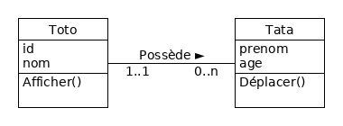

# Algorithmique et Programmation Orientée Objet

Par [Salima HASSAS](https://docplayer.fr/68641307-Cours-de-programmation-orientee-objets-salima-hassas-universite-claude-bernard-lyon-1.html)

[Page de l'UE](http://offre-de-formations.univ-lyon1.fr/ue-295-12%2Falgorithmique-et-programmation-orientee-objet.html)

## Logiciel d'édition de diagrammes UML

[**UMLet**](https://www.umlet.com/) : super petit éditeur UML mais on ne peut pas générer de code

### Lancement

```shell
umlet &
```

### Exemple de résultat



---

## Introduction

**TDA** : Type de Donnée Abstrait (modèle de donnée => classe)

Différence entre **polymorphisme** et l'**héritage** :

- Héritage : imbriquation des classes les unes dans les autres
- Polymorphisme : utilisation d'un même nom de méthode pour plusieurs types d'objets différents

Bien respecter la syntaxe UML page 54 du [diapo](Cours.pdf)
