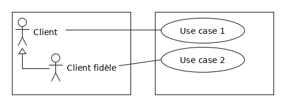
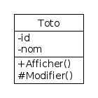
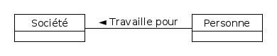
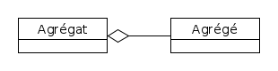
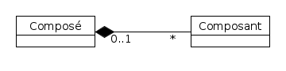
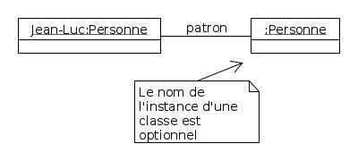
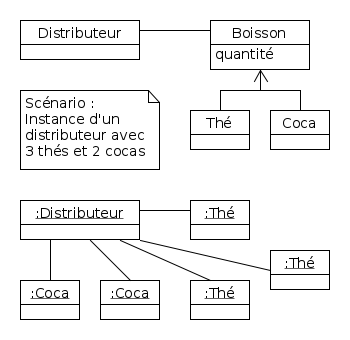

# Algorithmique et Programmation Orientée Objet

Par [Salima HASSAS](https://docplayer.fr/68641307-Cours-de-programmation-orientee-objets-salima-hassas-universite-claude-bernard-lyon-1.html)

[Page de l'UE](http://offre-de-formations.univ-lyon1.fr/ue-295-12%2Falgorithmique-et-programmation-orientee-objet.html)

## Logiciel d'édition de diagrammes UML

[**UMLet**](https://www.umlet.com/) : super petit éditeur UML mais on ne peut pas générer de code

### Lancement

```shell
umlet &
```

### Exemple de résultat


---

## Introduction

**TDA** : Type de Donnée Abstrait (modèle de donnée => classe)

Différence entre **polymorphisme** et l'**héritage** :

- Héritage : imbriquation des classes les unes dans les autres
- Polymorphisme : utilisation d'un même nom de méthode pour plusieurs types d'objets différents

Bien respecter la syntaxe UML page 54 du [diapo](images_cours/Cours.pdf)

## Diagrammes

### Cas d'utilisation (Use Case)

Tout ce qui est **directement** visible par l'utilisateur ainsi que les **include** et **extends**

**Pour** retirer de l'argent **il faut** s'identifier : *retirer* -> **include** -> *s'autentifier*

**En** retirant de l'argent **on peut** voir le solde : *retirer* -> **extends** -> *voir solde*

Pas besoin de relations redondantes lorsqu'on a de l'héritage  


-> Le client fidèle hérite de *Use case 1*

### Diagramme de classes

- Public : "+"
- Protégé : "#" -> accessible depuis les sous-classes
- Privé : "-" -> non accessible depuis les sous-classes



Personne contient un attribut du type société  


L'**agrégat** est plus important que l'agrégé mais les deux sont **associés l'un à l'autre** (un peintre et son oeuvre, une personne et son habitation...)  


La **composition** est une agrégation où l'agrégé est **physiquement contenu** dans l'agrégat  


### Diagramme d'objets

#### Exemple simple de nomage



En cas d'héritage dans un diagramme de classe (boisson <- coca | thé), la classe abstraite n'apparait pas dans le diagramme d'objet : on représente une vraie instance  


### Diagramme de séquence
